# `<center>`**Классификация клиентов банка**

В датасете представлены данные о последней маркетинговой кампании, которую проводил банк: задачей было привлечь клиентов для открытия депозита. Необходимо проанализировать эти данные, выявить закономерность и найти решающие факторы, повлиявшие на то, что клиент вложил деньги именно в этот банк. Решение задачи поможет поднять доходы банка и понять целевую аудиторию, которую необходимо привлекать путём рекламы и различных предложений.

> Бизнес-задача: определить характеристики, по которым можно выявить клиентов, более склонных к открытию депозита в банке, и за счёт этого повысить результативность маркетинговой кампании.

> Техническая задача: построить модель машинного обучения, которая на основе предложенных характеристик клиента будет предсказывать, воспользуется он предложением об открытии депозита или нет.
>
> ## `<center>`**1. Предобработка данных**
>
> + Данные о клиентах банка:
>
>   + age (возраст);
>   + job (сфера занятости);
>   + marital (семейное положение);
>   + education (уровень образования);
>   + default (имеется ли просроченный кредит);
>   + housing (имеется ли кредит на жильё);
>   + loan (имеется ли кредит на личные нужды);
>   + balance (баланс).
> + Данные, связанные с последним контактом в контексте текущей маркетинговой кампании:
>
>   + contact (тип контакта с клиентом);
>   + month (месяц, в котором был последний контакт);
>   + day (день, в который был последний контакт);
>   + duration (продолжительность контакта в секундах).
> + Прочие признаки:
>
>   + campaign (количество контактов с этим клиентом в течение текущей кампании);
>   + pdays (количество пропущенных дней с момента последней маркетинговой кампании до контакта в текущей кампании);
>   + previous (количество контактов до текущей кампании)
>   + poutcome (результат прошлой маркетинговой кампании).
> + Целевая переменная
>
>   + deposit, которая определяет, согласится ли клиент открыть депозит в банке.
>   + Данные о клиентах банка:
>
>     + age (возраст);
>     + job (сфера занятости);
>     + marital (семейное положение);
>     + education (уровень образования);
>     + default (имеется ли просроченный кредит);
>     + housing (имеется ли кредит на жильё);
>     + loan (имеется ли кредит на личные нужды);
>     + balance (баланс).
>   + Данные, связанные с последним контактом в контексте текущей маркетинговой кампании:
>
>     + contact (тип контакта с клиентом);
>     + month (месяц, в котором был последний контакт);
>     + day (день, в который был последний контакт);
>     + duration (продолжительность контакта в секундах).
>   + Прочие признаки:
>
>     + campaign (количество контактов с этим клиентом в течение текущей кампании);
>     + pdays (количество пропущенных дней с момента последней маркетинговой кампании до контакта в текущей кампании);
>     + previous (количество контактов до текущей кампании)
>     + poutcome (результат прошлой маркетинговой кампании).
>   + Целевая переменная
>
>     + deposit, которая определяет, согласится ли клиент открыть депозит в банке.

## `<center>`**2.  Разведывательный анализ**

### 2.1. Изучим соотношение классов на предмет сбалансированности

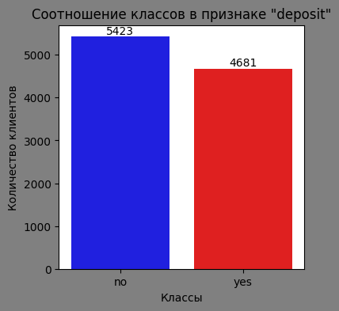

Судя по графику, классы 'yes' и 'no' в признаке сбалансированы, что позволит построить модель классификации без дополнительных преобразований.

### 2.2. Количественные переменные.

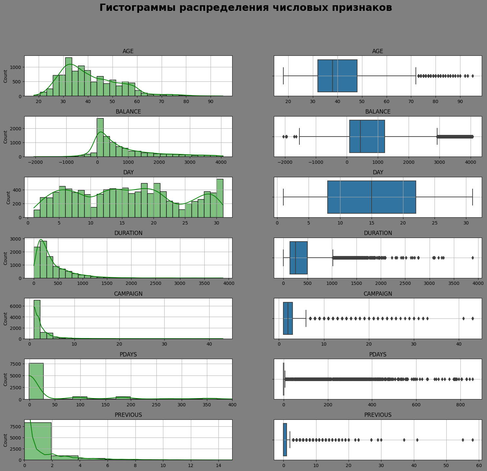

В датасете представлены 7 числовых признаков: возраст; баланс; день контакта в маркетинговую кампанию; продолжительность в секундах; количество контактов, количество пропущенных дней с момнента последней кампании; количество контактов до текущей кампании.

По признаку "Age" на момент маркетинговой кампании возраст клиентов банка находится в промежутке от 18 до 95 лет. Данные клиентов старше 70 лет можно отнести к категории аномальных значений. Большая часть клиентов банка в возрасте до 40 лет, модальное значение в районе 33-35 лет. От 40 до 60 клиентов меньше, распределены они равномерно. После отметки 60 лет наблюдается спад. Таким образом, большая часть клиентов банка - это работающие специалисты с высшим образованием, так как резкий рост числа клиентов начинается в возрасте 25 лет, когда присходит выпуск из высшего учебного заведения. Это люди, которые относятся к категории молодых специалистов (до 35 лет), которые еще не заняли высокие управленческие должности.

Распределение по признаку "Баланс" логнормальное, оно хорошо демонстрирует доходность активов. Виден отрицательный баланс до -2049$, но большая его часть все-таки до -1000$. У большего количества вкладчиков баланс до 200$, затем разко снижается количество вкладчиков относительно баланса. Медианное значение в районе 400-500$. Также в признаке наблюдаются аномальные значения с двух сторон. В банках США депозит - это срочный вклад с повышенным процентом. Но если средства снимаются досрочно, то вкладчику начисляется штраф. С этим может быть также связан отрицательный баланс счета. Небольшие суммы вкладов на короткий срок под повышенный процент соответствуют портрету клиента, описанному в признаке "Возраст".

Следующие признаки связаны с маркетиноговой кампанией банка.

Признак "Day" - день, в который был последний контакт. Соответствуют дню месяца. Распределение в признаке равномерное. Наблюдаются небольшие спады, что, видимо, связано с днями подготовки отчетности в банке. Резкий подъем работы с клиентами в конце и начале месяца.

В признаке "Duration" - продолжительность общения с клиентом в секундах. Распределение признака логнормальное. Минимальная продолжительность - 2 секунды. Более 2000 контактов длится до 60 секунд. Можно предположить, что данные клиенты отказались от разговора. Модальное значение в районе 200-250 секунд. Это та продолжительность времени, которую готовы уделить клиенты этой категории для общения по вопросам кампании. Потому что большая часть контактов, судя по признаку "Day" совершается в рабочее время. После этой отметки резкий спад продолжительности контакта. Самое длительное общение 3381 секунда, что соответствует 56 минутам. В признаке также много выбросов.

В признаке "Campaign" количество контактов с клиентов в течение текущей маректинговой кампании. Большая часть контактов = 1, медианное значение на отметке - 2. С несколькими клиентами понадобилось 3 контакта. Максимальное значение в признаке - 43. Звонки клиенту больше 6 раз можно отнести к категории выбросов. 2-6 звонков возможно связано с тем, что менеджер перезванивал клиенту в более удобное время.

Признак "pdays" количество пропущенных дней с момента последней маркетинговой кампании. Здесь минимальное и медианное значения совпадают = -1. То есть не было пропусков в контакте с клиентами. Максимальное значение 854.

Признак "Previous" содержит информацию о количестве контактов с клиентом до текущей кампании. Минимальное и медианное значение совпадают и равны 0. Это говорит о том, что 50% - это новые клиенты банка, которые на попадали под предыдущие маркетинговые кампании. Максимальное значение 58. Можно говорить о том, что только у банка 25% клиентов долгосрочно выбирают этот депозит. Стоит обратить внимание на вероятный отток клиентов из банка.

Признаки "balance", "duration", "pdays" имеют большой разброс в значениях.

### 2.3. Категориальные переменные

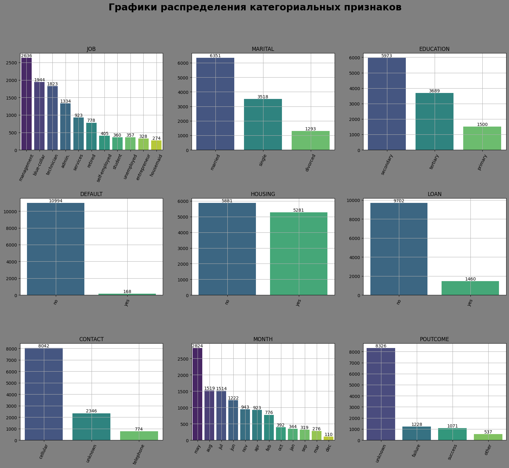

В признаке "job" показано, что клиентами банка являются представители 11 сфер занятости.

+ менеджер
+ рабочий
+ технический персонал
+ администратор
+ служащий
+ пенсионер
+ самозанятый
+ безработный
+ студент
+ предприниматель
+ домработница

Большую часть клиентов банка составляют менеджеры (2314), рабочие (1807), технический персонал (1638), администраторы(1246). Незначительное число составляют студенты и пенсионеры, что подтверждвет связсб с признаком "Age", а также банк не популярен среди предпринимателей, топ-менеджеров, высокопрофессиональных специалистов. С этим связан преимущественно небольшой баланс на депозитах клиентов.

В признаке "marital" представлено три категории клиентов: состоящие в браке, одинокие, разведенные. Половина клиентов банка люди, состоящие в браке.

В признаке "education" клиенты банка разделены соответстенной системе уровней образования, принятой в США. Большее число клиентов банка окончили старшую школу (5517), затем увеличивается дисбаланс классов. Клиентов, окончивших колледж или университет, меньше (3238), и самой малочисленной явояется категория клиентов с начальным образованием (1349). Услуги, которые предлагает банк наиболее востребованы среди клиентов, получивших школьное образование, и имеющих невысокий уровень дохода.

Признак "default" явялется бинарным и содержит информацию о том, имеется ли у клиента просроченный кредит. В признаке значительный дисбаланс в пользу клиентов, которые выплачивают кредиты вовремя (9938).

Признак "housing" бинарный, разделяет клиентов на имеющих кредит на жилье и тех, у кого его нет. Категории в признаке распределены почти равномерно с небольшим перевесом клиентов, не имеющих ипотеки (5243).

В признаке "loan" содержится информация о кредите на личные нужды. Признак бинарный со значительным дисбаланосом. Большая часть клиентов не имеют кредита на личные нужды (8711).

Признак "contact" содержит информацию о типе контакта банка с клиентом. В признаке содержится 3 категории "контакт по мобильному телефону", "неизвестен", "стационарный телефон". Банк информирует клиентов о своих продуктах преимущественно по телефону. Самый распространенный тип связи с помощью мобильного телефона - 7282. Остальные категории значительно меньше. Возможно для данной категории клиентов телефон - наиболее оптимальный способ связи. Но чтобы привлекать клиентов другой профессиональной деятельности и с другим уровнем образования необходимо использовать другие способы связи.

В признаке "month" 12 категорий - месяц, в который был последний контакт с клиентом. Пик маркетинговых кампаний банка приходится на месяц май, затем все лето ее высокая активность. Видимо банк предлагает различные летние скидки и бонусы, что может быть по мнению банка выгодно для клиентов в период летних отпусков. Низкая активность маркетинговой кампании в зимние месяцы и в марте.

Признак "poutcom" содержит информацию о прошлой маркетинговой кампании.В признаке четыре категории: "неизвестно", "неудача", "успех", "другое". Наибольшее значение у категории "неизвестно" (7570). По остальным категориям количество меньше и распределены они почти равномерно.

### 2.4. Определим для какого статуса предыдущей маркетинговой кампании успех в текущей превалирует над количеством неудач.

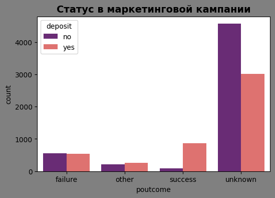

### 2.5. Соотношение открытия / неоткрытия депозита по месяцам

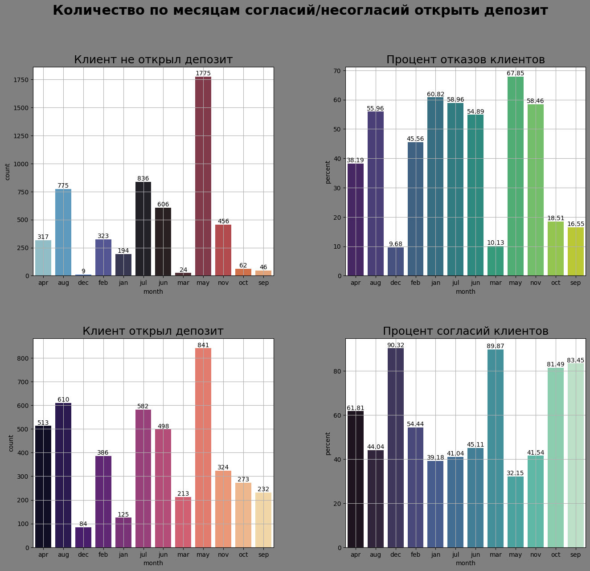

У данного банка активность маркетинговой кампании приходится на май и летние месяцы. На эти же месяцы наблюдается и наибольший процент отказов и максимальное их количество как рав в мае(67,85%). Это можно связать с ростом активности маркетинговой кампании. Но количество отказов от депозита скорее всего связано с праздниками, например, день матери в мае и день отца в июне, день независимости 4 июля. Учитывая категорию клиентов они могут быть не готовы вкладывать деньги накануне праздников.

Процент согласий растет в сентябре и октябре, когда есть возможность сделать краткосрочный вклад перед рождеством. Самый большой процент согласий в декабре, но это связано с тем, что в этом месяце очень низкая общая активность маркетинговой кампании. Если в сентябре при 83% 232 клиента открыли депозит, то в декабре при 90% всего 84.

Также высокий процент согласий приходится на май. Как раз за 2 месяца до начала праздников.

### 2.6. Результат маркетинговой кампании по возрастным группам.

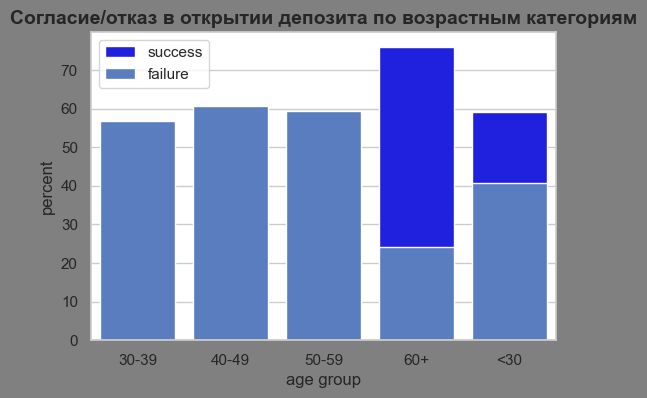

С положительным успехом маркетинговая кампания проходит среди клиентов в категории 60+ и до 30 лет. Но ниабольшее число клиетов банка находится в категории 30-39 лет.

### 2.7. Результат маркетинговой кампании в зависимости от семейного статуса, уровня образования и сферы занятости

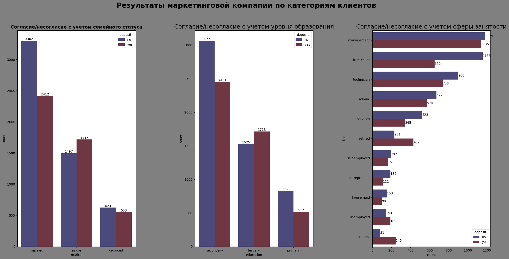

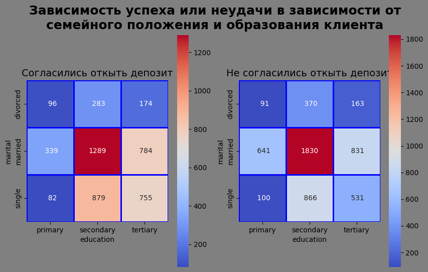

По сферам занятости склонны соглашаться с предложениями банка пенсионеры, безработные, студенты. Большое количество согласий у менеджеров, технического персонала, администраторов, но отказов в этих категоряих незначительно больше.

Значительное различие в категорях в пользу отказов у рабочих и служащих.

По признаку уровня образования склонны соглашаться спредложениями банка клиенты, находящиеся на третьей ступени образования. У большей части клиентов со второй ступенью количество отказов превышает количество согласий.

По признаку семейного положения большее количество положительных исходов маркетинговой кампании среди одиноких клиентов. Среди клиентов, состоящих в браке, доля отказов выше.

**Характеристики групп клиентов банка**

Большая часть клиентов банка в возрасте 30-50 лет, окончившие старшую школу, состоящие в браке. Их сфера деятельности - менеджмент, рабочие профессии, технический персонал, администраторы, служащие. У них редки просрочки по кредитам и редко берут кредит на личные нужды. Наличие или отсутствие кредита на жилье находится примерно в равных долях.

Клиенты, которые чаще соглашаются на предложения банка находятся в двух возрастных категориях - старше 60 лет и до 30 лет. Это люди, не состоящие в браке, прошедшие третью ступень образования, которые в настоящий момент находятся на пенисии, либо являются студентами или безработными.

## `<center>`**3. Преобразование данных**

### 3.1. Кодирование признаков

### 3.2. Анализ корреляции признаков

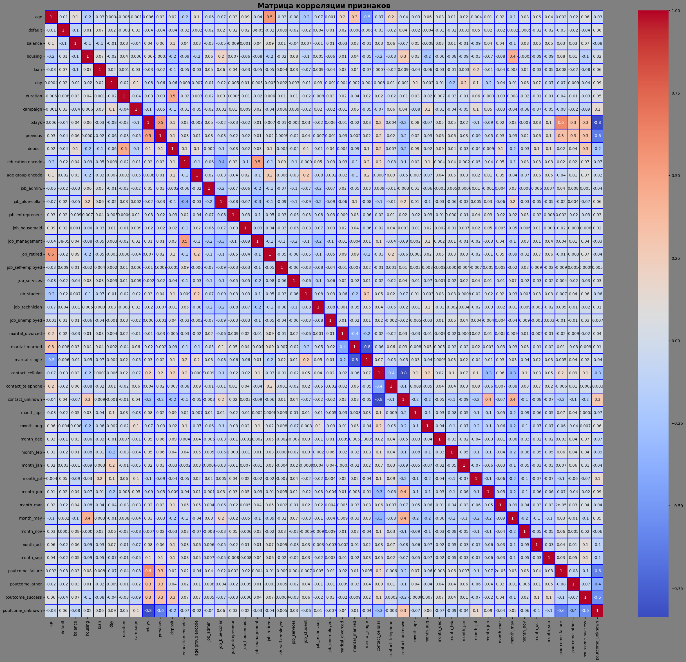

Возьмем за уровень мультиколлениарности коэффициент корреляции 0.9. Таких признаков в датасете нет. Самый высоки коэффициент корреляции - 0.8.

### 3.3. Подготовка датасета, отбор признаков

Отберем значимые для обучения признаки, используя статсистические фильтры. В данном случае применим корреляцию Пирсона.

15 наиболее значимых признаков для обучения:

```
['balance' 'housing' 'duration' 'campaign' 'pdays' 'previous'
 'age group encode' 'contact_cellular' 'contact_unknown' 'month_mar'
 'month_may' 'month_oct' 'month_sep' 'poutcome_success' 'poutcome_unknown']
```

### 3.4. Нормализация признаков

При применении нормализации методом MinMaxScaler все значения признаков будут преобразованы в диапазон [0,1], что означает, что минимальное и максимальное значение признака будет равно 0 и 1 соответственно.

Нормализация происходит следующим способом:

Из каждого значения признака х вычитается минимальное значение этого признака:

$x - min$

Результат вычитания делится на разность между максимумом и минимумом признака:

$max - min$

 $x_{scaled} = \frac{x - x_{min}}{x_{max} - x_{min}}$

Это нужно для того, чтобы признаки, которые находятся в разных масштабах не влияли на обучение модели.

## `<center>`**4. Решение задачи классификации: логистическая регрессия и решающие деревья**

### 4.1. Метрики классификации

**Accuracy (достоверность)** — доля правильных ответов модели среди всех ответов. Правильные ответы — это истинно положительные (True Positive) и истинно отрицательные ответы (True Negative):

$accuracy = \frac{TP + TN}{TP + TN + FN + FP}$

**Precision (точность), или PPV (Positive Predictive Value)** — это доля объектов, которые действительно являются положительными, по отношению ко всем объектам, названным моделью положительными.

$precision = \frac{TP}{TP+FP}$

**Recall (полнота), или TPR (True Positive Rate)** — это доля объектов, названных классификатором положительными, по отношению ко всем объектам положительного класса.

$recall = \frac{TP}{TP + FN}$

**$F_{\beta}$** - это взвешенное среднее гармоническое между precision и recall:

$F_{\beta} = (1+\beta^{2})\frac{precision \cdot recall}{(\beta^{2} precision) + recall}$

### 4.2. Логистическая регрессия


### 4.3. Деревья решений


## `<center>`**5. Решение задачи классификации: ансамбли моделей**

### 5.1. Бэггинг: Случайный лес


### 5.2. Бустинг: градиентный бустинг


### 5.3. Стекинг


Модели на основе алгоритмов стекинга и бустинга показали себя лучше других. Для итоговой модели используем алгоритм градиентного бустинга, так как в нем подели обучаются последовательно нивилируя ошибки предыдущих моделей.

### 5.4. Оптимизация гиперпараметров модели градиентного бустинга с помощью Optuna

Наилучшие значения гиперпараметров 'n_estimators': 177,

 'max_depth': 16,

 'min_samples_leaf': 5

f1_score на обучающем наборе: 0.83

f1_score на тестовом наборе: 0.82

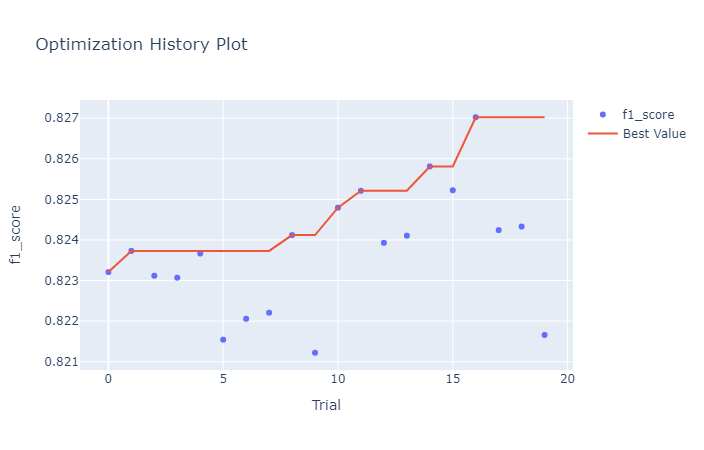

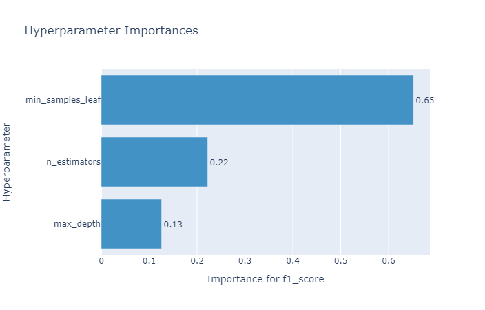

## `<center>`**6. Заключение**

Лучшие результаты для решения задачи показала модель на основе алгоритма градиентного бустинга. В данном случае нам важно сохранить баланс между метриками precision и recall, то есть сбаланисровать ложноположительные и ложноотницательные срабатывания. Для тестовой выборки F-мера равна 0.82. В идеальном состоянии метрика стремится к значению 1.

Соотношение метрик на тренировочной и тестовой выборках говорит об отсутствии как переобучения, так и недообучения модели.

Для увеличения количества клиентов, которые открывают депозит в банке во время маркетинговой кампании можно обратить внимание на категории клиентов, которые не являются многочисленными.

Клиенты, которые чаще соглашаются на предложения банка находятся в двух возрастных категориях - старше 60 лет и до 30 лет. Это люди, не состоящие в браке, прошедшие третью ступень образования, которые в настоящий момент находятся на пенисии, либо являются студентами или безработными.

Также можно попробовать другие сроки активности маркетиноговой кампании.

Процент согласий растет в сентябре и октябре, когда есть возможность сделать краткосрочный вклад перед рождеством. Самый большой процент согласий в декабре, но это связано с тем, что в этом месяце очень низкая общая активность маркетинговой кампании. Если в сентябре при 83% 232 клиента открыли депозит, то в декабре при 90% всего 84. Также высокий процент согласий приходится на май. Как раз за 2 месяца до начала праздников.
